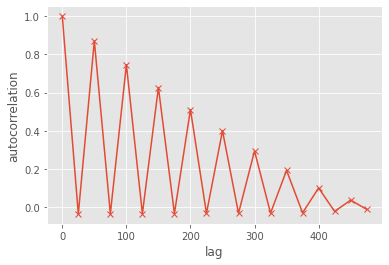

# Auto-Correlations in TRNGs
Study of correlations in (pseudo) random bits.

## Installation

Clone the repository and install as a python package. For instance, on Colab do:

```bash
!pip install --upgrade pip --quiet
!git clone https://github.com/maciejskorski/deep_correlations_trng.git --quiet
%cd deep_correlations_trng
!pip install . --quiet
```

## Data Files

Data files are stored in a separate folder and accessed by a utility function `read_bits`:

```python
try:
    from importlib.resources import files
except:
    from importlib_resources import files
from deep_correlations_trng.utils import read_bits
from deep_correlations_trng import data

data_file = files(data).joinpath('acq_20220608163343_all_dff_out1.bin')
bits = read_bits(data_file)
```

## Analyse Data

Data can be analyzed in various ways. Below we estimate the autocorrelation function from 256M bits

```python
import numpy as np
from scipy.stats import pearsonr

lags = np.arange(0,20)*25

results = []
for lag in lags:
  if lag == 0:
    r = (1,0)
  else:
    r = pearsonr(bits[lag:],bits[:-lag])
  results.append((lag,)+tuple(r))

import matplotlib.pyplot as plt
plt.style.use('ggplot')
fig, ax = plt.subplots()
plt.plot(lags,np.array(results)[:,1],marker='x')
ax.set_xlabel('lag')
ax.set_ylabel('autocorrelation')

```
shown in the figure below



See [notebook experiments](notebooks) for more details.
